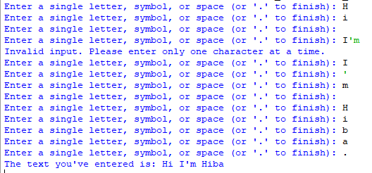

## Description 
This program allows users to compose text by entering single characters interactively. Characters are collected one by one, and to conclude input, users can enter a period ('.'), which will not be displayed in the final output.    
This program is designed for simplicity and basic text composition. It may not be suited for users who need to enter 
larger amounts of text quickly. And it doesn't include advanced error handling features.  
## Example 

